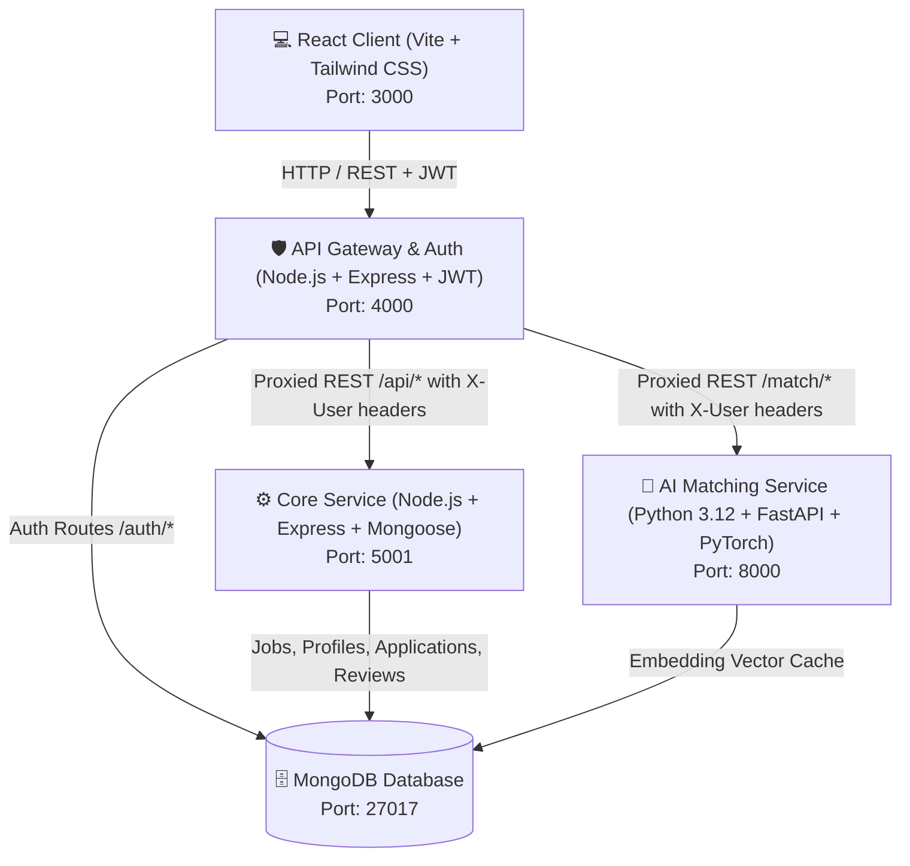

# SkillForge ⚡
> **AI-Powered Freelance & Job-Matching Platform built with Microservices Architecture**

SkillForge is a full-stack freelance marketplace where clients post projects and freelancers are matched using an AI service that calculates semantic fit using high-dimensional NLP embeddings (`all-MiniLM-L6-v2`) instead of keyword search.

---

## 🏗️ Architecture Overview



---

## 🚀 Tech Stack

| Component | Technology | Purpose |
| :--- | :--- | :--- |
| **Client** | React 18, Vite, Tailwind CSS, Lucide, Recharts, Axios | Responsive glassmorphism UI, client/freelancer dashboards, real-time analytics |
| **API Gateway** | Node.js, Express, JWT, `http-proxy-middleware`, `express-rate-limit`, `helmet` | Single entry point, user auth, RBAC enforcement, proxy routing |
| **Core Service** | Node.js, Express, Mongoose, `express-validator` | CRUD for jobs, freelancer profiles, applications, and reviews |
| **Matching Service** | Python 3.12, FastAPI, `sentence-transformers`, `motor`, `numpy` | 384-dim dense vector embeddings, cosine similarity scoring, MongoDB cache |
| **Database** | MongoDB 7.0 | Document store for platform entities and vector cache |
| **Containerization** | Docker & Docker Compose | Multi-container orchestration with healthchecks and network isolation |

---

## ✨ Key Features

### 1. 🧠 AI Semantic Match Engine (FastAPI + Sentence-Transformers)
- Uses the `all-MiniLM-L6-v2` model to transform project requirements and candidate bios into 384-dimensional dense vectors.
- Calculates cosine similarity via vector dot products.
- Applies experience level weighting bonuses.
- Persists computed embeddings in MongoDB with SHA-256 hash keys to eliminate redundant model inference on repeat requests.

### 2. 🛡️ API Gateway & JWT Auth
- Role-based authorization (`client` vs `freelancer`).
- Forwarding user identity headers (`X-User-Id`, `X-User-Role`) to downstream services.
- Rate limiting protection for authentication and API proxy endpoints.

### 3. 💼 Complete Project & Application Flow
- Clients post projects with skill tags, budget ranges, and experience requirements.
- Freelancers browse open gigs with real-time keyword search and submit proposals with custom cover letters and rates.
- Clients can trigger **"Rank Candidates with AI"** to see live match percentages before accepting or shortlisting.

### 4. ⭐ Reviews & Reputation System
- Comprehensive 5-star ratings with category breakdown (Communication, Quality, Expertise, Timeliness).
- Automatic average rating and review count recalculation for freelancer profiles.

### 5. 📊 Interactive Analytics Dashboard
- Visualized with **Recharts**:
  - Top in-demand skills aggregated via MongoDB `$unwind` and `$group` aggregation pipelines.
  - Daily application velocity trend charts.
  - Category breakdown and platform KPI overview.

---

## 📁 Repository Structure

```
skillforge/
├── client/                     # React 18 + Vite + Tailwind CSS
│   ├── src/
│   │   ├── api/                # Axios instance with JWT interceptor
│   │   ├── context/            # AuthContext state provider
│   │   ├── components/         # Navbar, ProtectedRoute, UI cards
│   │   ├── pages/              # Login, Register, Dashboards, PostJob, Applicants, Analytics
│   │   ├── App.jsx             # React Router configuration
│   │   └── main.jsx
│   ├── Dockerfile              # Multi-stage build with Nginx
│   └── nginx.conf
├── gateway-service/            # Node.js + Express API Gateway
│   ├── src/
│   │   ├── middleware/         # JWT verification, RBAC, rate limiting
│   │   ├── models/             # User auth model
│   │   ├── proxy/              # http-proxy-middleware configuration
│   │   ├── routes/             # /auth (login, register, me)
│   │   └── index.js            # Express server
│   └── Dockerfile
├── core-service/               # Node.js + Express + Mongoose Backend
│   ├── src/
│   │   ├── middleware/         # Gateway user header extractor
│   │   ├── models/             # Job, Profile, Application, Review models
│   │   ├── routes/             # /api/jobs, /api/profiles, /api/applications, /api/reviews, /api/analytics
│   │   └── index.js
│   └── Dockerfile
├── matching-service/           # Python 3.12 + FastAPI AI Service
│   ├── app/
│   │   ├── models/             # Pydantic schemas (MatchRequest, MatchResponse)
│   │   ├── routers/            # /match/score, /match/score/batch, /health
│   │   ├── services/           # SentenceTransformer embedding & cache service
│   │   ├── config.py           # Pydantic settings
│   │   ├── database.py         # Async Motor MongoDB client
│   │   └── main.py             # FastAPI application
│   ├── requirements.txt
│   └── Dockerfile
└── docker-compose.yml          # Multi-container orchestration
```

---

## 🚦 Quick Start with Docker Compose

### Prerequisites
- Docker & Docker Compose installed.

### Run All Services
```bash
# Clone the repository
git clone https://github.com/VijaySaravanaPandi/skillforge.git
cd skillforge

# Build and start all 4 services + MongoDB
docker compose up --build
```

### Access Endpoints
- **React Client**: [http://localhost:3000](http://localhost:3000)
- **API Gateway**: [http://localhost:4000](http://localhost:4000)
- **FastAPI Interactive Docs**: [http://localhost:8000/docs](http://localhost:8000/docs)
- **Core Service**: `http://localhost:5001`
- **MongoDB**: `localhost:27017`

---

## 🛠️ Local Development (Without Docker)

### 1. Start MongoDB
Ensure MongoDB is running locally on port `27017`.

### 2. Start Gateway Service
```bash
cd gateway-service
npm install
npm run dev
# Running on http://localhost:4000
```

### 3. Start Core Service
```bash
cd core-service
npm install
npm run dev
# Running on http://localhost:5001
```

### 4. Start AI Matching Service
```bash
cd matching-service
python -m venv venv
# On Windows:
.\venv\Scripts\activate
# On Linux/macOS:
source venv/bin/activate

pip install -r requirements.txt
uvicorn app.main:app --reload --port 8000
# Running on http://localhost:8000
```

### 5. Start Client
```bash
cd client
npm install
npm run dev
# Running on http://localhost:5173
```

---

## 📡 API Reference Summary

### Gateway Service (`/auth`)
| Method | Route | Description |
| :--- | :--- | :--- |
| `POST` | `/auth/register` | Register a new user (`client` or `freelancer`) |
| `POST` | `/auth/login` | Login and obtain JWT |
| `GET` | `/auth/me` | Get current user profile (JWT protected) |

### Core Service (`/api`)
| Method | Route | Description |
| :--- | :--- | :--- |
| `GET` | `/api/jobs` | Browse jobs with search and filter parameters |
| `POST` | `/api/jobs` | Post a new job (Client only) |
| `GET` | `/api/jobs/client/my` | Get all jobs posted by current client |
| `GET` | `/api/profiles/me` | Get freelancer profile |
| `POST` | `/api/profiles` | Create freelancer profile |
| `PATCH` | `/api/profiles/me` | Update freelancer profile |
| `POST` | `/api/applications` | Apply for a job (Freelancer only) |
| `GET` | `/api/applications/job/:jobId` | View applicants for a job |
| `PATCH` | `/api/applications/:id/status` | Update applicant status (`accepted`, `shortlisted`, `rejected`) |
| `POST` | `/api/reviews` | Submit post-project review and rating |
| `GET` | `/api/analytics/top-skills` | Get top in-demand skills aggregation |
| `GET` | `/api/analytics/application-trends` | Get application frequency trends |

### AI Matching Service (`/match`)
| Method | Route | Description |
| :--- | :--- | :--- |
| `POST` | `/match/score` | Compute cosine match scores between job and freelancer embeddings |
| `POST` | `/match/score/batch` | Batch process multiple job matches |
| `GET` | `/health` | Service uptime and health status |

---

## 📜 License
MIT License © 2026 Vijay Saravana Pandi
